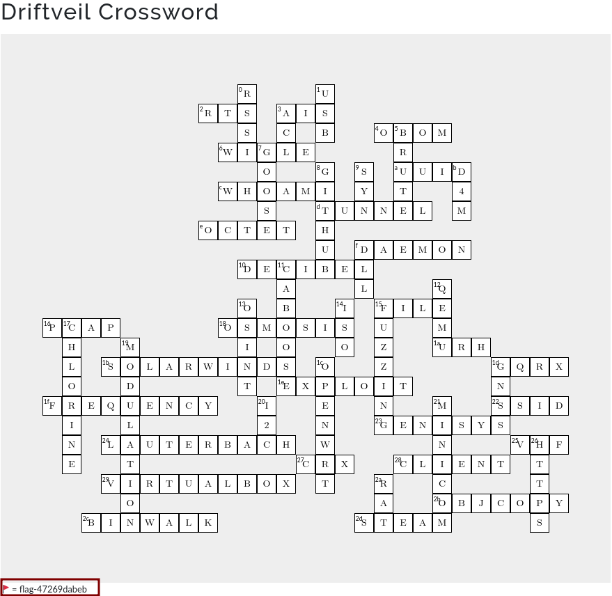

# Crossword

Points: 200

Category: Security Foundations

Author Description: 

```
Solve the crossword puzzle located at https://ctf.cisaicsctf.com/crossword to reveal the flag.

Flag format: flag will appear next to a flag icon in the lower-left corner of the crossword webpage once the puzzle has been solved. Example: flag-123456789a
```

Solution:

This challenge is pretty straightforward. You just solve the crossword and the flag shows up at the end. I was able to see the flag, before entering the last 3 words as well. I will post the questions towards the end if you want to reference that as well.



Crossword Clues:

```
Across

2. Serial line used when you have something to say
3. Can be spoofed to make ships appear where they are not
4. Listing of all hardware components used in a product
6. Crowdsourced database of IEEE 802.11 networks
a. 87728b87-cab5-4a26-944f-87dceef24a09
c. Command to verify if root shell has been accessed
d. Used to pass network traffic through hops
e. One quarter of an IPv4 address
f. A UNIX process that runs in the background and distributes tasks
10. Unit for measuring signal strength
15. GNU command for identifying contents of a file
16. Wireshark output file
18. Water purification process (reverse ___)
1a. Tool for reverse engineering RF signals
1b. Manufacturer of host monitoring software breached in 2020
1d. SDR software developed by OZ9AEC
1e. An attack against a vulnerability
1f. Number of occurrences per unit of time
22. Friendly name of an IEEE 802.11 wireless network
23. Union Switch & Signal SCADA protocol for the rail industry
24. German company behind TRACE32 debugger suite
25. Section of spectrum used for commercial FM broadcast
27. Chrome extension file extension
28. Opposite of a server (in a ___-server architecture)
29. Open source desktop virtualization software from Oracle
2b. GNU utility for copying and converting object files
2c. Utility for identifying files inside binary blob (e.g., firmware)
2d. Type of locomotive primarily powered by a boiler

Down

0. Measurement of power present in a received radio signal
1. A, B, C, micro, mini
3. List of users or groups with permissions
5. Trying every member of a keyspace is a(n) ___-force attack
7. IEC 61850 substation events
8. Microsoft-owned platform for collaborative development
9. TCP flag for initiating connection
b. Deny, delay, disrupt, destroy, or manipulate
f. Windows shared library
11. Final car of a freight train
12. Open source tool for emulating different architectures
13. Information gathering using public sources
14. Image file type named after the file system used on CD-ROMs
15. Searching for vulnerabilities by providing many inputs
17. Atomic #17, used in water treatment
19. Varying one or more properties of a wave to encode data
1c. Linux distribution for embedded devices, especially routers
1d. GPS, GLONASS, BeiDou, Galileo
20. 2 line serial protocol often used for small displays on microcontrollers
21. Miquel van Smoorenburg's utility for interacting with serial port
26. GET, POST, and PUSH over TLS
2a. Remote Access Trojan
```

Flag: `flag-47269dabeb`
